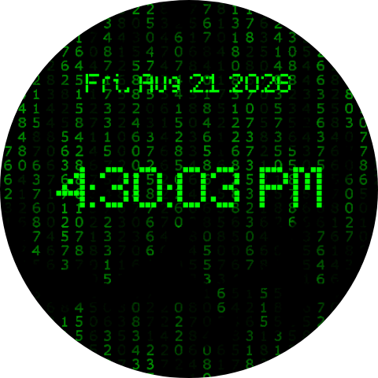

# Matrix Time for Android WearOS

This Matrix watchface is based from this repo that was never updated.  
https://github.com/dheera/android-wearface-matrix  
I made a fork with font picker in it.  that old fork will not work on newer wearos versions.        

I re-made it in Andriod Studio in Watch Face Format XML format to work on newer wearos versions.   
Good news, I am able to make font picker in this new format.      
You can pick any fonts :)    

 
This watchface will work on WearOS 6 and newer Pixel Watches and Any watches with WearOS 6 or above
This watchface will work on WearOS 5 and newer Pixel Watches and Galaxy Watch 7     
This watchface will work on WearOS 4 versions.  I tested this watchface on my Pixel Watch 2 and it is working on it too.  

